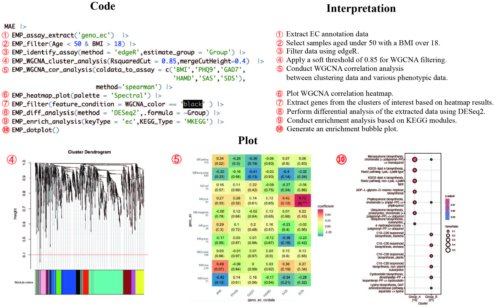

## EasyMultiProfiler: An Efficient and Convenient R package in Multi-omics Down-Stream Analysis and Visualization
<a href="man/figures/logo.png"></a>


[](https://github.com/liubingdong/EasyMultiProfier)

The EasyMultiProfiler package aims to offer a user-friendly and efficient multi-omics data analysis tool on the R platform. It facilitates various essential tasks related to microbiome, genome, and metabolite downstream analysis, providing a seamless workflow from start to finish.

### What Can EasyMultiProfiler Offer?

- **Quick Screening**: Simplify sample selection across multiple omics for efficient research.
- **Dynamic Processing**: Effortlessly switch between standardization, differential analysis, correlation, enrichment analysis, etc.
- **One-Step Analysis**: Effortlessly execute complex methods like WGCNA and GSEA in a single step.
- **Streamlined Workflow**: Experience a clear, organized data analysis process that enhances productivity and clarity.
- **Caching Technology**: Leverage built-in caching to save time and computational resources during data exploration.

**Let EMP enhance your research and transform your data analysis experience!**

**Example below**



### Install

<u>The R version must be **4.3.3** or higher.</u>

**Easily install (recommend)**

```R
if (!requireNamespace("pak", quietly=TRUE)) install.packages("pak")
pak::pak("liubingdong/EasyMultiProfiler")
library(EasyMultiProfiler)
```
<u>NOTE 1:</u>  For some regions with unstable networks, users could utilize the local mirrors to avoid unexpected errors before installation.

```R
## For china main land users could use this
local({r <- getOption("repos")
r["CRAN"] <- "https://mirrors.tuna.tsinghua.edu.cn/CRAN/"
options(repos=r)}
)
options(BioC_mirror="https://mirrors.ustc.edu.cn/bioc/")
options("download.file.method"="libcurl")
options("url.method"="libcurl")
```

<u>NOTE 2:</u>  For different R versions on the Windows platform, users need to install appropriate rtools to support the necessary compile environment (eg. for R 4.3.x need RTool4.3, for R 4.4.x need RTool4.4, [click here ~ 400MB](https://mirrors.tuna.tsinghua.edu.cn/CRAN/)). Afterward, simply restart R and re-try below:

```R
pak::pak("liubingdong/EasyMultiProfiler")
```

**Manual install** 

Due to the inclusion of many popular analysis tools, the EMP package relies on dependencies distributed across GitHub, CRAN, and Bioconductor repositories. Therefore, users may encounter dependency issues during installation in different network environments. If installation errors occur, we suggest manually installing any missing dependencies based on the error prompts. Thank you for being so patient during installation. We believe EMP could greatly speed up your research work.

```R
# In the step, please type in : 1 2 3 4 5 6 7 
setRepositories(addURLs = c(BioCsoft = "https://bioconductor.org/packages/3.18/bioc",
                  BioCann = "https://bioconductor.org/packages/3.18/data/annotation"))  
options(timeout = 600000000) 
install.packages("remotes") # remotes (>= 2.5.0)
remotes::install_version("patchwork",version='1.2.0',force = TRUE) # patchwork (1.2.0)
install.packages("BiocManager") # BiocManager (>= 1.30.22)
BiocManager::install("base64enc") # base64enc (>= 0.1.3)
BiocManager::install("WGCNA") # WGCNA (>= 1.72.5)
BiocManager::install("clusterProfiler") # clusterProfiler (>= 4.10.0)
remotes::install_github("liubingdong/EasyMultiProfiler")
library(EasyMultiProfiler)
```

More installation errors and solutions: [**Click this**](https://github.com/liubingdong/EasyMultiProfiler/blob/main/tutorial_related/Installation.md)

### Update new version
The EasyMultiProfiler package is continuously being updated with more analysis and visualization modules. When a new version is needed, simply run pak again to update.
```R
pak::pak("liubingdong/EasyMultiProfiler")
library(EasyMultiProfiler)
```

### Usage and tutorial
For more details, please refer to the tutorial:

Website: [**Source 1**](https://main--gorgeous-smakager-db1548.netlify.app/)  [**Source 2**](https://liubingdong.github.io/EasyMultiProfiler_tutorial/) [**Source 3**](http://easymultiprofiler.xielab.net) 

### Citation
The official article for **EasyMultiProfiler** is still under submission. If this package can assist with your work, please feel free to cite its predecessor **EasyMicroPlot**  as below:

EasyMicroPlot : An Efficient and Convenient R Package in Microbiome Downstream Analysis and Visualization for Clinical Study. doi: [10.3389/fgene.2021.803627](https://www.frontiersin.org/articles/10.3389/fgene.2021.803627/full)

### Contributing
We welcome any contribution, including but not limited to code, ideas, and tutorials. Please report errors and questions on GitHub [**Issues**](https://github.com/liubingdong/EasyMultiProfiler/issues)). 

