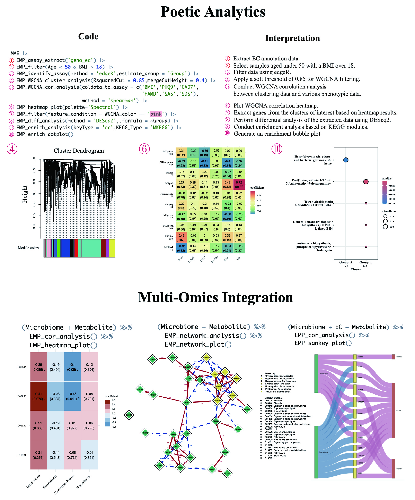

## EasyMultiProfiler: An Efficient and Convenient R package in Multi-omics Downstream Analysis and Visualization
<a href="man/figures/logo.png"></a>


The EasyMultiProfiler package aims to offer a user-friendly and efficient multi-omics data analysis tool on the R platform. It facilitates various essential tasks related to microbiome, genome, and metabolite downstream analysis, providing a seamless workflow from start to finish.

### What Can EasyMultiProfiler Offer?

- **Quick Screening**: Simplify sample selection across multiple omics for efficient research.
- **Dynamic Processing**: Effortlessly switch between standardization, differential analysis, correlation, enrichment analysis, etc.
- **One-Step Analysis**: Effortlessly execute complex methods like WGCNA and GSEA in a single step.
- **Streamlined Workflow**: Experience a clear, organized data analysis process that enhances productivity and clarity.
- **Caching Technology**: Leverage built-in caching to save time and computational resources during data exploration.

**Let EMP enhance your research and transform your data analysis experience!**

**Example below**



### Install

<u>The R version must be **4.3.3** or higher.</u>

**1. Easily install (recommend)**

```R
if (!requireNamespace("pak", quietly=TRUE)) install.packages("pak")
pak::pak("liubingdong/EasyMultiProfiler")
library(EasyMultiProfiler)
```
<u>NOTE 1:</u>  For some regions with unstable networks, users could utilize the local mirrors to avoid unexpected errors before installation.

```R
## For example, China main land users could use this
local({r <- getOption("repos")
r["CRAN"] <- "https://mirrors.tuna.tsinghua.edu.cn/CRAN/"
options(repos=r)}
)
options(BioC_mirror="https://mirrors.ustc.edu.cn/bioc/")
options("download.file.method"="libcurl")
options("url.method"="libcurl")
```

<u>NOTE 2:</u>  If encountering issues related to missing compilation environments, users can resolve them by following the solution. For different R versions on the Windows platform, users need to install appropriate rtools to support the necessary compile environment (eg. for R 4.3.x need RTool4.3, for R 4.4.x need RTool4.4, [click here ~ 400MB](https://mirrors.tuna.tsinghua.edu.cn/CRAN/)). For Mac os  platform, users could install gfortran([click here ~ 242MB](https://github.com/R-macos/gcc-12-branch/releases)). Afterward, simply restart computer and re-try below:

```R
pak::pak("liubingdong/EasyMultiProfiler")
```

<u>NOTE 3:</u>  EasyMultiProfiler has consistently been updating its versions while striving to maintain compatibility with the original code and syntax. Specific versions can be installed using the pak package to ensure consistency in users' data analyses.  Version could be found on  https://github.com/liubingdong/EasyMultiProfiler/commits/main/.

```R
pak::pak("liubingdong/EasyMultiProfiler@0c66ed3")
```

**2. Manual install** 

Due to the inclusion of many popular analysis tools, the EMP package relies on dependencies distributed across GitHub, CRAN, and Bioconductor repositories. Therefore, users may encounter dependency issues during installation in different network environments. If installation errors occur, we suggest manually installing any missing dependencies based on the error prompts. Thank you for being so patient during installation. We believe EMP could greatly speed up your research work.

```R
# In the step, please type in : 1 2 3 4 5 6 7 
setRepositories(addURLs = c(BioCsoft = "https://bioconductor.org/packages/3.18/bioc",
                  BioCann = "https://bioconductor.org/packages/3.18/data/annotation"))  
options(timeout = 600000000) 
install.packages("remotes") # remotes (>= 2.5.0)
remotes::install_version("patchwork",version='1.2.0',force = TRUE) # patchwork (1.2.0)
install.packages("BiocManager") # BiocManager (>= 1.30.22)
BiocManager::install("base64enc") # base64enc (>= 0.1.3)
BiocManager::install("WGCNA") # WGCNA (>= 1.72.5)
BiocManager::install("clusterProfiler") # clusterProfiler (>= 4.10.0)
remotes::install_github("liubingdong/EasyMultiProfiler")
library(EasyMultiProfiler)
```

**3. More installation errors and solutions:**

If the above solutions still fail to successfully complete the installation, we have prepared detailed installation guides for you.

[**How to fix it**](http://easymultiprofiler.xielab.net/en/MD/1%20EasyMultiProfiler%20introduction.html#11)
[**如何解决安装问题**](http://easymultiprofiler.xielab.net/ch/MD/1%20EasyMultiProfiler%20introduction.html#11)

### Update new version
The EasyMultiProfiler package is continuously being updated with more analysis and visualization modules. When a new version is needed, simply run pak again to update.

```R
pak::pak("liubingdong/EasyMultiProfiler")
library(EasyMultiProfiler)
```

### Usage and tutorial
For more details, please refer to the tutorial:

Website: [**Source 1**](https://main--gorgeous-smakager-db1548.netlify.app/)  [**Source 2**](https://liubingdong.github.io/EasyMultiProfiler_tutorial/) [**Source 3**](http://easymultiprofiler.xielab.net) 

### Acknowledge
This package integrates multiple widely-used tools, and we sincerely acknowledge their authors for their valuable contributions. Special thanks to [**Prof. Guangchuang Yu**](https://github.com/YuLab-SMU)  (Southern Medical University, China) for his guidance. We strongly recommend citing the original publications of the corresponding tools when using this package.

### Contributing
We welcome any contribution, including but not limited to code, ideas, and tutorials. Please report errors and questions on GitHub [**Issues**](https://github.com/liubingdong/EasyMultiProfiler/issues)). 

