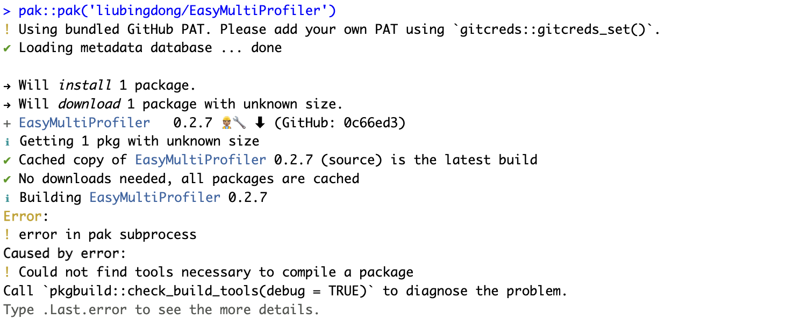
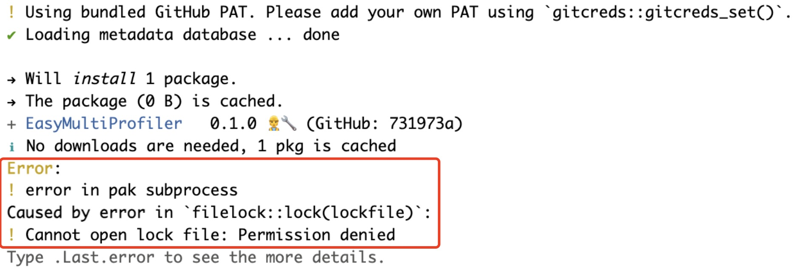

 

## Installation issues


EasyMultiProfiler depends on several R packages, so issues such as environment dependency conflicts may arise during installation. This section covers common installation errors and their solutions.

EasyMultiProfiler depends on several R packages, so issues such as environment dependency conflicts may arise during installation. This section covers common installation errors and their solutions.

###  10.5.1 **Easily install**

```R
if (!requireNamespace("pak", quietly=TRUE)) install.packages("pak")
if (!requireNamespace("remotes", quietly=TRUE)) install.packages("remotes")
remotes::install_version("patchwork",version='1.2.0',force = TRUE)
pak::pak("liubingdong/EasyMultiProfiler")
library(EasyMultiProfiler)
```
#### 1. Common error about the timeout
Solution method:
>For some regions with unstable network, users could utilize the local mirrors to avoid unexpected errors before installation.
```R
## For china main land users could use this
local({r <- getOption("repos")
r["CRAN"] <- "https://mirrors.tuna.tsinghua.edu.cn/CRAN/"
options(repos=r)}
)
options(BioC_mirror="https://mirrors.ustc.edu.cn/bioc/")
options("download.file.method"="libcurl")
options("url.method"="libcurl")
```

#### 2. Common error about the "pkgbuild::check build tools(debug = TRUE)"



<u>**Solution for Windows users :**</u>

>Windows users may encounter an error <u>"Could not find tools necessary to compile a package"<u> during the installation process. To address this, it's essential to install Rtools beforehand (eg. for R 4.3.x need RTool4.3, for R 4.4.x need RTool4.4, [click here ~ 400MB](https://mirrors.tuna.tsinghua.edu.cn/CRAN/)). Afterward, simply restart R and re-try >```pak::pkg_install("liubingdong/EasyMultiProfiler")```.


<u>**Solution for Mac users :**</u>

>Many R packages require a compiler environment during installation. To ensure maximum compatibility, it is recommended that new users install the specified version of gfortran below, rather than the latest version. After successful installation, restart your computer before attempting to install EasyMultiProfiler.
>Download link: ：[Official Source](https://github.com/R-macos/gcc-12-branch/releases)

#### 3. Common error about "Cannot open lock file: Permission denied"



>For this situation, users could delete the un-downloaded files in the R

```R
## For mac
rm -rf /Library/Frameworks/R.framework/Versions/4.3-arm64/Resources/library/_cache/*
```

### 10.5.2 **Manual install** 

```R
# In the step, please type in : 1 2 3 4 5 6 7 
setRepositories(addURLs = c(BioCsoft = "https://bioconductor.org/packages/3.18/bioc",
                  BioCann = "https://bioconductor.org/packages/3.18/data/annotation"))  
options(timeout = 600000000) 
install.packages("remotes") # remotes (>= 2.5.0)
remotes::install_version("patchwork",version='1.2.0',force = TRUE) # patchwork (1.2.0)
install.packages("BiocManager") # BiocManager (>= 1.30.22)
BiocManager::install("base64enc") # base64enc (>= 0.1.3)
BiocManager::install("WGCNA") # WGCNA (>= 1.72.5)
BiocManager::install("clusterProfiler") # clusterProfiler (>= 4.10.0)
remotes::install_github("liubingdong/EasyMultiProfiler")
library(EasyMultiProfiler)
```
#### 1. Common error about the timeout.

Solution method:
>Because EasyMultiProfiler includes many necessary data to provide comprehensive tools, the package size (~10MB) may lead to install timeout errors for some users in bad network regions. Users could reset the Max link time to make sure the installation is successful.
```R
options(timeout = 600000000) 
```

#### 2. Common error about the can't find the Bioconductor repository by install_github

Solution method:

>Users could set the correct repository handly to make the installation.

```R
setRepositories(addURLs = c(BioCsoft = "https://bioconductor.org/packages/3.18/bioc",
                  BioCann = "https://bioconductor.org/packages/3.18/data/annotation"))  
```


#### 3. Common errors about patchwork

Because the patchwork has two versions to lead to unexpected conflict in the package enrichplot, users need to degrade the patchwork from 2.4 to 1.2.0.


Solution method 1:

>During the installation process, be careful not to upgrade the patchwork to version 2.4.


Solution method 2:

>If conflict already occurred, users could check the patchwork version and re-install patchwork at the version 1.2.0.

```R
remotes::install_version("patchwork",version='1.2.0',force = TRUE)
pak::pkg_install("liubingdong/EasyMultiProfiler") ## After restart R
```

